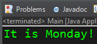
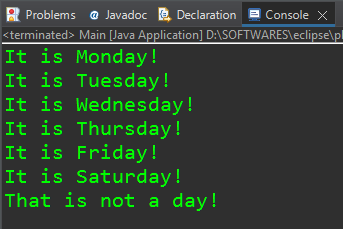

# Switch Statement in Java.

## Code:

```java
public class Main {

	public static void main(String[] args) {
		
		// switch = statement that allows a variable to be tested for equality against a list of values
		
		String day = "Monday";
		
		switch(day) {
			case "Sunday": System.out.println("It is Sunday!");
			break;
            // break; statement instructs the compiler that if there is a match found with the case (i.e case "Sunday") -- then execute the code within this case and skip going through all the following cases and the default case.

			case "Monday": System.out.println("It is Monday!");
			break;
			case "Tuesday": System.out.println("It is Tuesday!");
			break;
			case "Wednesday": System.out.println("It is Wednesday!");
			break;
			case "Thursday": System.out.println("It is Thursday!");
			break;
			case "Friday": System.out.println("It is Friday!");
			break;
			case "Saturday": System.out.println("It is Saturday!");
			break;
			default: System.out.println("That is not a day!");
            // default case executes in case there is no match with any of the listed cases.
		}
				
	}
}
```

## Output:



---

# Importance of break statement.

## Code: Above program without using break statement.

```java
public class Main {

	public static void main(String[] args) {
		
		// switch = statement that allows a variable to be tested for equality against a list of values
		
		String day = "Monday";
		
		switch(day) {
			case "Sunday": System.out.println("It is Sunday!");
			case "Monday": System.out.println("It is Monday!");
			case "Tuesday": System.out.println("It is Tuesday!");
			case "Wednesday": System.out.println("It is Wednesday!");
			case "Thursday": System.out.println("It is Thursday!");
			case "Friday": System.out.println("It is Friday!");
			case "Saturday": System.out.println("It is Saturday!");
			default: System.out.println("That is not a day!");
		}				
	}
}
```

## Output:




***If 'break;' statement is not used at the end of every case, then, when the compiler finds a match with any of the listed case (see the above code) , it will execute the code of not only the matched case but also of all the rest of the cases that follows the matched case.*** 