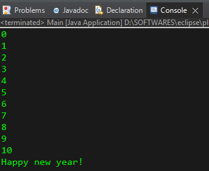
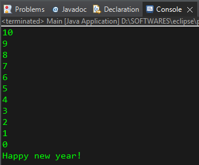
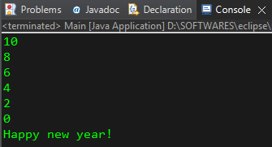

# Code 1:

```java
public class Main {

	public static void main(String[] args) {
		
		// for loop = executes a block of code a limited amount of times
		
        // i++  =  increment operator = incrementing 1 unit per iteration. 
		for(int i=0; i<=10; i++) {
			System.out.println(i); // 0-10
		}
		
		System.out.println("Happy new year!");		
	}
}
```

# Output 1:




# Code 2:

```java
public class Main {

	public static void main(String[] args) {
		
		// for loop = executes a block of code a limited amount of times
		
        // i--  =  decrement operator  = decrementing 1 unit per iteration. 
		for(int i=10; i>=0; i--) {
			System.out.println(i); // 10-0		
		}
		System.out.println("Happy new year!");
	}
}
```

# Output 2:




# Code 3:

```java
public class Main {

	public static void main(String[] args) {
		
		// for loop = executes a block of code a limited amount of times
		
		// i -= 2 : decrementing the value of i by 2 units per iteration.
		for(int i=10; i>=0; i -= 2) {
			System.out.println(i); // 10-8-6-4-2-0	
            // i -= 2;	
		}
		System.out.println("Happy new year!");
	}
}
```

# Output 3:



