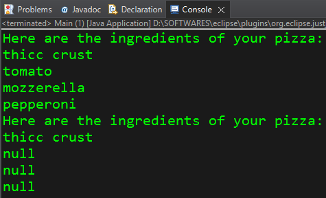

```java
// Constructor Overloading
//**************************
// overloaded constructors = multiple constructors within a class with the same name but having different parameters.
// name + parameters = signature					   = 

public class Pizza {
	String bread;
	String sauce;
	String cheese;
	String topping;
	
	// Constructor Overloading
	//**************************
	
	// Parameterless Constructor
	// Parameterless Constructor gets added by default if we do not give any constructor from our side. 
	Pizza(){		
	}
	
	// Parameterized: 1 String parameter
	Pizza(String bread){
		
		this.bread = bread;
	}
	
	// Parameterized: 2 String parameter
	Pizza(String bread,String sauce){
		
		this.bread = bread;
		this.sauce = sauce;
	}
	
	// Parameterized: 3 String parameter
	Pizza(String bread,String sauce,String cheese){
		
		this.bread = bread;
		this.sauce = sauce;
		this.cheese = cheese;
	}
	
	// Parameterized: 4 String parameter
	Pizza(String bread,String sauce,String cheese,String topping){
		
		this.bread = bread;
		this.sauce = sauce;
		this.cheese = cheese;
		this.topping = topping;
	}
}

public class Main {

	public static void main(String[] args) {
		
		Pizza pizza = new Pizza("thicc crust","tomato","mozzerella","pepperoni");
		
		System.out.println("Here are the ingredients of your pizza: ");
		System.out.println(pizza.bread);
		System.out.println(pizza.sauce);
		System.out.println(pizza.cheese);
		System.out.println(pizza.topping);

        Pizza pizza = new Pizza("thicc crust");
		
		System.out.println("Here are the ingredients of your pizza: ");
		System.out.println(pizza.bread);
		System.out.println(pizza.sauce);
		System.out.println(pizza.cheese);
		System.out.println(pizza.topping);
	}

}
```
