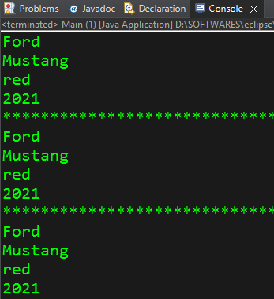

```java
// toString() = A method of the Object class that all objects inherit,
// that returns a string that "textually represents" an object.
// can be used both implicitly and explicitly

public class Car {
	String make = "Ford";
	String model = "Mustang";
	String color = "red";
	int year = 2021;

	//overriding the toString() method
	public String toString() {
		return make +"\n"+model+"\n"+color+"\n"+year;
        // returning values of the object, so that we don't need to write much code.
	}
}

public class Main {

	public static void main(String[] args) {

		  Car car = new Car();

		  System.out.println(car.toString());
		  // Normally, if we do not override the .toString() method in Car class, then the above line of code will print the address of the 'car' object in the memory (i.e. hashcode value of the object).
		  // '.toString()' method is available to every object in Java.
		  // By overriding the toString() method of the Object class, we can return values of the object, so we don't need to write much code.

          System.out.println("**************************************************************");


		  System.out.println(car);
		  // compiler writes here System.out.println(car.toString())
		  // This will also print the same ouput as 'System.out.println(car.toString());' code.


          System.out.println("**************************************************************");


          // Code for getting the same output without using toString() method.
          System.out.println(car.make);
          System.out.println(car.model);
          System.out.println(car.color);
          System.out.println(car.year);

	}
}
```


