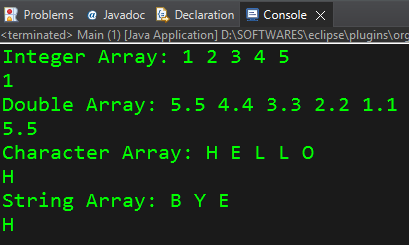

# Generic Method:

```java
public class Main {

    public static void main(String args[]) {
        
        Integer[] intArray = {1, 2, 3, 4, 5};
        Double[] doubleArray = {5.5, 4.4, 3.3, 2.2, 1.1};
        Character[] charArray = {'H', 'E', 'L', 'L', 'O'};
        String[] stringArray = {"B","Y","E"};
        
        System.out.print("Integer Array: ");
        displayArray(intArray);
        System.out.println(firstIndex(intArray));

        System.out.print("Double Array: ");
        displayArray(doubleArray);
        System.out.println(firstIndex(doubleArray));

        System.out.print("Character Array: ");
        displayArray(charArray);
        System.out.println(firstIndex(charArray));
        
        System.out.print("String Array: ");
        displayArray(stringArray);
        System.out.println(firstIndex(charArray));
    }
	   
    // Without Generic Method:
	   
    // public static void displayArray(Integer[] array) {

    //     for(Integer x : array) {
    //         System.out.print(x+" ");
    //     }
    //     System.out.println();
    // }
    
    // public static void displayArray(Double[] array) {

    //     for(Double x : array) {
    //         System.out.print(x+" ");
    //     }
    //     System.out.println();
    // }
    
    // public static void displayArray(Character[] array) {

    //     for(Character x : array) {
    //         System.out.print(x+" ");
    //     }
    //     System.out.println();
    // }
    
    // public static void displayArray(String[] array) {

    //     for(String x : array) {
    //         System.out.print(x+" ");
    //     }
    //     System.out.println();
    // }
	   
    // Generic method
    // Generic Method will work for any and every reference dataType/wrapper class - that we give in place of 'Thing'.
    // To make a Generic Method, <Thing> or <T> is writen just before the return type of the function declaration.
    public static <Thing> void displayArray(Thing[] array) {

        for(Thing x : array) {
            System.out.print(x+" ");
        }
        System.out.println();
    }
    
    
    // Generic method with generic return type 
    public static <Thing> Thing firstIndex(Thing[] array) {
        return array[0];
    }
}
```

### Output:




# Generic Class:

## Example 1: Without Using Generic Class.

```java
public class MyIntegerClass { 
	int x;
	
	MyIntegerClass(int x){
		this.x = x;
	}
	
	public int getValue() {
		return x;
	}
}

public class MyDoubleClass {
	double x;
	
	MyDoubleClass(double x){
		this.x = x;
	}
	
	public double getValue() {
		return x;
	}
}

public class MyCharClass {
	char x;
	
	MyCharClass(char x){
		this.x = x;
	}
	
	public char getValue() {
		return x;
	}
}

public class MyStringClass {
	String x;
	
	MyStringClass(String x){
		this.x = x;
	}
	
	public String getValue() {
		return x;
	}
}

public class Main {
	public static void main(String[] args) {
		
	   MyIntegerClass myInt = new MyIntegerClass(1);
	   MyDoubleClass myDouble = new MyDoubleClass(3.14);
	   MyCharClass myChar = new MyCharClass('@');
	   MyStringClass myString = new MyStringClass("Hello");
	  
	   	   
	   System.out.println(myInt.getValue()); //1
	   System.out.println(myDouble.getValue()); //3.14
	   System.out.println(myChar.getValue()); //@
	   System.out.println(myString.getValue()); //Hello
	}
}
```

## Example 2: Same Program Using Generic Class

```java
// A Generic class allows us to pass - a fixed number of arguments - but - of any reference dataType or wrapper class of our choice - to its constructor - when we create an instance of the class.

public class MyGenericClass <Thing>{   
	
	// MyGeneric class can take 1 argument of any reference dataType or wrapper class (denoted by <Thing>)

	Thing x;
	
	MyGenericClass(Thing x){
		this.x = x;
	}
	
	public Thing getValue() {
		return x;
	}
}

public class Main {
	public static void main(String[] args) {
		
	   // While creating objects/instances of any Generic class, we can pass in (the specified # of) arguments of any reference dataType or wrapper class - to its constructor.
		
	   MyGenericClass<Integer> myInt = new MyGenericClass<>(1);  // Passing argument of Integer wrapper class.
	   MyGenericClass<Double> myDouble = new MyGenericClass<>(3.14);  // Passing argument of Double wrapper class.
	   MyGenericClass<Character> myChar = new MyGenericClass<>('@');	// Passing argument of Character wrapper class.
	   MyGenericClass<String> myString = new MyGenericClass<>("Hello"); // Passing argument of String wrapper class.
	  
	   	   
	   System.out.println(myInt.getValue()); //1
	   System.out.println(myDouble.getValue()); //3.14
	   System.out.println(myChar.getValue()); //@
	   System.out.println(myString.getValue()); //Hello

       ArrayList<Integer> list = new ArrayList<>();
	   list.add(56);
	   System.out.println(list.get(0)); //56
	   // An ArrayList is similar to a Generic class taking 1 argument.
	}
}
```

If you compare the codes of Example 1 and 2, you can see that 1 Generic class (MyGenericClass) has provided an easy substitute for all the 4 classes (MyIntegerClass, MyDoubleClass, MyCharClass, MyStringClass).


## Example 3: Generic class taking more than Argument/Parameter.

```java
public class MyGenericClass <Thing1, Thing2>{   // A Generic class allows us to pass - a fixed number of arguments - but - of any reference dataType or wrapper class of our choice - to its constructor - when we create an instance of the class.
	
	// MyGeneric class can take 1 argument of any reference dataType or wrapper class (denoted by <Thing>)

	Thing1 x;
	Thing2 y;
	
	MyGenericClass(Thing1 x, Thing2 y){
		this.x = x;
		this.y = y;
	}
	
	public void getValue() {
		System.out.print("X = "+x + " ");
		System.out.println("Y = "+y);
	}
}

public class Main {
	public static void main(String[] args) {
		
	   MyGenericClass<Integer, Integer> myInt = new MyGenericClass<>(1,1);
	   MyGenericClass<Double,Double> myDouble = new MyGenericClass<>(3.14, 0.58);
	   MyGenericClass<Character, Character> myChar = new MyGenericClass<>('@', 'K');
	   MyGenericClass<String, Character> myString = new MyGenericClass<>("Hello", '#');
	  
	   // Using Generic class 'MyGenericClass <Thing1, Thing2>', we can create instances with a variety of different refernce classes, wrapper classes and their combinations - as dataTypes for the class constructor arguments. However, the total number of arguments that the constructor can take while creating an instance is fixed (defined during making of the Generic class itself) - but we can just pass arguments of any reference dataType or wrapper class as per our needs.
	   	   
	   myInt.getValue(); //X = 1 Y = 1
	   myDouble.getValue(); //X = 3.14 Y = 0.58
	   myChar.getValue(); //X = @ Y = K
	   myString.getValue(); //X = Hello Y = #

       HashMap<String, String> list2 = new HashMap<>();
	   list2.put("Japan", "Tokyo");
	   System.out.println(list2);
	   // Hashmap is similar to a Generic class taking 2 arguments.
	}
}
```

# Bounded DataTypes:

```java
public class MyGenericClass <Thing1 extends Number, Thing2 extends Number>{
	
	//bounded dataTypes = We can limit the variety of dataTypes that can be used while creating instances of a Generic class by using 'bounded dataTypes'
	
	// In this example, since both the Generic class argument dataTypes <Thing1, Thing2> are extending from a Parent class 'Number' --> <Thing1 extends Number, Thing2 extends Number> --> therefore, we can only substitute <Thing1, Thing2> datatypes with reference classes or wrapper classes ---> that directly inherit/extends from the Parent 'Number' class. So, we have set a restriction on the reference classes or wrapper classes which can be used to pass arguments, while creating instances of 'MyGenericClass'.
	
	// 'Number' is a class in Java (java.lang.Number) 
	// Subclasses of 'Number' class are -- AtomicInteger, AtomicLong, BigDecimal, BigInteger, Byte, Double, Float, Integer, Long, Short.
	// We can choose our 2 arguments for MyGenericClass constructor <Thing1 extends Number, Thing2 extends Number>,  belonging to any of the reference classes mentioned above -- which directly inherits the 'Number' class.

	Thing1 x;
	Thing2 y;
	
	MyGenericClass(Thing1 x, Thing2 y){
		this.x = x;
		this.y = y;
	}
	
	public Thing2 getValue() {
		return y;
		
	}
}

public class Main {
	public static void main(String[] args) {
				   
	   MyGenericClass<Integer,Integer> myInt = new MyGenericClass<>(1,9);
	   MyGenericClass<Double,Double> myDouble = new MyGenericClass<>(3.14,1.01);   
	   //MyGenericClass<Character,Character> myChar = new MyGenericClass<>('@','$');
	   //MyGenericClass<String,Character> myString = new MyGenericClass<>("Hello",'!');
	   
	   // Since Character and String classes are not inherited or extended from the 'Number' class, therefore, the commented lines will give error if executed.
	  
	   	   
	   System.out.println(myInt.getValue());
	   System.out.println(myDouble.getValue());
	  //System.out.println(myChar.getValue());
	  //System.out.println(myString.getValue());
	}
}
```