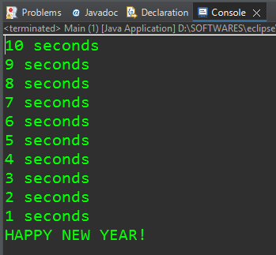

```java
import java.util.Calendar;
import java.util.Timer;
import java.util.TimerTask;

public class Main {
	
	public static void main(String[] args) {
		
		// Timer = 		A facility for threads to schedule tasks 
		//				for future execution in a background thread
		
		// TimerTask = 	A task that can be scheduled for one-time 
		//				or repeated execution by a Timer
		
		Timer timer = new Timer();  // This timer object will keep track of the time.
		
		TimerTask task = new TimerTask() {   // Here, we are creating a anonymous inner class that inherits from TimerTask class - does some alterations on the OG TimerTask class as per user requirements - and then we create an object 'task' from this inherited anonymous class. 
			
			int counter = 10;
			
			@Override
			public void run() {  // run() method is the only undefined method of the OG TimerTask class - to be overrided by the anonymous class.  // When our 'timer' reaches a certain point, it is gonna execute the 'run' function of our 'task' instance.
				
//				System.out.println("Task is complete.");
				if(counter>0) {
					System.out.println(counter+" seconds");
					counter--;
				}
				else {  //when counter = 0
					System.out.println("HAPPY NEW YEAR!");
					timer.cancel();  //this aborts the 'timer' object operation.
				}
			}		
		};
		
		//timer.schedule(task, time)  //time = delay --> is normally in milliseconds
		//timer.schedule(task, 0);  //task executed after 0s. 
		//timer.schedule(task, 3000);  //task executed after 3000 milliseconds.
		
		Calendar date = Calendar.getInstance();  //Creating an instance of Calendar class.
		date.set(Calendar.YEAR,2022);  //setting the year of the date instance
		date.set(Calendar.MONTH,Calendar.DECEMBER);  //setting the month of the date instance
		date.set(Calendar.DAY_OF_MONTH,7); //setting the day_of_month of the date instance
		date.set(Calendar.HOUR_OF_DAY,17); //setting the hour_of_day of the date instance //24-hours format
		date.set(Calendar.MINUTE,27); //setting the minutes of the date instance
		date.set(Calendar.SECOND,0); //setting the seconds of the date instance
		date.set(Calendar.MILLISECOND,0);  //setting the milliseconds of the date instance
		
//		timer.schedule(task, date.getTime());  //date.getTime() gives the time remaining between the execution of this program & the set date in milliseconds.
		
//		timer.scheduleAtFixedRate(task, 0, 1000);  //(task, starting time, keep-repeating-task-after-time)
		timer.scheduleAtFixedRate(task, date.getTime(), 1000);
		
	}

}
```
