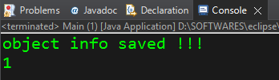
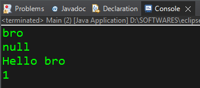

# Inside Project Folder "Serializer"

### Main.java: 

```java
import java.io.FileOutputStream;
import java.io.IOException;
import java.io.ObjectOutputStream;
import java.io.ObjectStreamClass;

public class Main {

	public static void main(String[] args) throws IOException{
		
	   // Serialization = 	The process of converting an object into a byte stream.
	   //					Persists the object (saves the state) after program exits
	   //					This byte stream can be saved as a file or sent over a network
	   //					Byte stream can be saved as a file (.ser) which is platform independent
	   //					(Think of this as if you're saving a file with the object's information)
		
	   User user = new User();
	   
	   user.name = "bro";
	   user.password = "I<3Pizza";
	   
	   // Now, I would like to save the state of the object 'user' such that I persists even after the program exits. 
	   
	   // Steps to Serialize
	   // ---------------------------------------------------------------
	   // 1. Go to the User class and implement Serializable interface
	   // 2. add import java.io.Serializable; to the User class.
	   // 3. Add this line of code -- FileOutputStream fileOut = new FileOutputStream(file path)  -- to the Main class (where the object has been created).
	   // 4. Add this line of code -- ObjectOutputStream out = new ObjectOutputStream(fileOut); -- to the Main class (where the object has been created).
	   // 5. Add this line of code -- out.writeObject(objectName) -- to the Main class (where the object has been created).
	   // 6. Add this line of code -- out.close(); fileOut.close(); -- to the Main class (where the object has been created).
	   // ---------------------------------------------------------------
		   
	   
	   //	   FileOutputStream fileOut = new FileOutputStream(file path);
	   FileOutputStream fileOut = new FileOutputStream("userInfo.ser");	
	   // A file 'userInfo.ser' is going to be created inside the project folder (refresh the folder to see it). But, if you want to create the file somewhere else, give the file path accordingly [with double-backslashes (\\)].
	   //	   ObjectOutputStream out = new ObjectOutputStream(fileOut);
	   ObjectOutputStream out = new ObjectOutputStream(fileOut);
	   //	   out.writeObject(objectName)
	   out.writeObject(user);
	   //	   out.close(); fileOut.close();
	   out.close();
	   fileOut.close();
	   
	   System.out.println("object info saved !!!");
	   
	   // Generating the SerialVersionUID Number for 'User' class.
	   long serialVersionUID = ObjectStreamClass.lookup(user.getClass()).getSerialVersionUID();
	   System.out.println(serialVersionUID);  // 1
	   
	   // We can set a user-defined serialVersionUID # for class 'User' in the 'User' class itself.  // If we do not do that, the compiler assigns a default serialVersionUID # for the class by itself.
	   }

}
```

### User.java

```java
import java.io.Serializable;

public class User implements Serializable {  // children classes of a parent class that implements Serializable will do so as well
	
//   SerialVersionUID = serialVersionUID is a unique ID that functions like a version #.
//	 Verifies that the sender and receiver of a serialized object,
//	 have loaded classes for that object that match exactly.
//	 Ensures object will be compatible between machines
//	 Number must match. otherwise this will cause a InvalidClassException
//	 A Default SerialVersionUID will be calculated based on class properties, members, etc.
//	 A serializable class can declare its own serialVersionUID explicitly (recommended)

	private static final long serialVersionUID = 1;
	// We can set a user-defined serialVersionUID # for class 'User' in the 'User' class itself.  
	// If we do not do that, the compiler assigns a default serialVersionUID # for the class by itself.
	// Here, we have given value '1' to serialVersionUID.
	
	String name;
	transient String password;	// Fields declared as "transient" aren't serialized, they're ignored
	
	public void sayHello() {
		System.out.println("Hello "+name);
	}

}
```

### Output:


# Inside Project Folder "Deserializer"

### Main.java:

```java
import java.io.FileInputStream;
import java.io.IOException;
import java.io.ObjectInputStream;
import java.io.ObjectStreamClass;

public class Main {

	public static void main(String[] args) throws IOException, ClassNotFoundException {
		// Deserialization = The reverse process of converting a byte stream into an object.
		//					(Think of this as if you're loading a saved file)
			
		//                   Steps to Deserialize
		//					---------------------------------------------------------------
		//					0. Declare your object but dont instantiate it. (In Main.java)
		//					1. Your class should implement Serializable interface (User.java)
		//					2. add import java.io.Serializable; (User.java)
		//					3. FileInputStream fileIn = new FileInputStream(file path);
		//					4. ObjectInputStream in = new ObjectInputStream(fileIn);
		//					5. objectNam = (Class) in.readObject();
		//					6. in.close(); fileIn.close();
		//					---------------------------------------------------------------
		
//		0. Declare your object but dont instantiate it. (In Main.java)
		User user = null;
		
//		3. FileInputStream fileIn = new FileInputStream(file path);
		FileInputStream fileIn = new FileInputStream("C:\\Users\\preet\\eclipse-workspace\\FirstJavaProject\\userInfo.ser");
		// For argument, give the address of the .ser file that you want to deserialize. If the file is within the project folder, just give its name, otherwise mention its full path [along with double-backslashes (\\)].
		
//		4. ObjectInputStream in = new ObjectInputStream(fileIn);
		ObjectInputStream in = new ObjectInputStream(fileIn);
		
//		5. objectName = (Class) in.readObject();
		user = (User) in.readObject();
		
//		6. in.close(); fileIn.close();
		in.close();
		fileIn.close();
		
		// Accessing the member variables of the user object that we just deserialized.
		System.out.println(user.name);
		System.out.println(user.password);
		user.sayHello();
		
		// Generating the SerialVersionUID Number for 'User' class.
		   long serialVersionUID = ObjectStreamClass.lookup(user.getClass()).getSerialVersionUID();
		   System.out.println(serialVersionUID); // 1
		// The serialVersionUID # for the class 'User' in both Serializer and Deserializer project folders will be same because both the 'User' classes are exact replicas of each other.
		   
		// If the 'User' class in both Serializer and Deserializer project folders are different, then on running this 'Main' class, the compiler is gonna throw a ClassNotFoundException. Also, the serialVersionUID # for both the 'User' classes are gonna be different then.
	}

}
```

### User.java

```java
import java.io.Serializable;

// To deserialize, we must possess the exact replica of the OG 'User' class on our system.
public class User implements Serializable {
	
//   SerialVersionUID = serialVersionUID is a unique ID that functions like a version #.
//	 Verifies that the sender and receiver of a serialized object,
//	 have loaded classes for that object that match exactly.
//	 Ensures object will be compatible between machines
//	 Number must match. otherwise this will cause a InvalidClassException
//	 A Default SerialVersionUID will be calculated based on class properties, members, etc.
//	 A serializable class can declare its own serialVersionUID explicitly (recommended)
	
	private static final long serialVersionUID = 1;
	// We can set a user-defined serialVersionUID # for class 'User' in the 'User' class itself.  
	// If we do not do that, the compiler assigns a default serialVersionUID # for the class by itself.
	// Here, we have given value '1' to serialVersionUID.
	
	
	String name;
	transient String password;  // Fields declared as "transient" aren't serialized, they're ignored
	
	public void sayHello() {
		System.out.println("Hello "+name);
	}

}

//Important notes	
//********************
//1. children classes of a parent class that implements Serializable will do so as well
//2. static fields are not serialized (they belong to the class, not an individual object)
//3. Fields declared as "transient" aren't serialized, they're ignored
//4. serialVersionUID is a unique version ID for a class that is serializable.
```


### Output:
