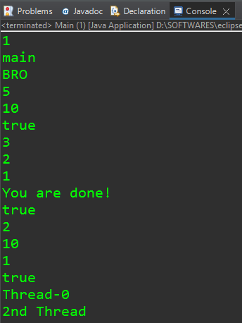

```java
public class Main{
	  
    public static void main(String[] args) throws InterruptedException{  

    	/*
    	thread =	A thread of execution in a program (kind of like a virtual CPU)
    				The JVM allows an application to have multiple threads running concurrently
    				Each thread can execute parts of you code in parallel with the main thread
    				Each thread has a priority.
    				Threads with higher priority are executed in preference compared to threads with a lower priority
    			
    			    The Java Virtual Machine continues to execute threads until either of the following occurs
    					1. The exit method of class Runtime has been called
    					2. All user threads have died
    					
    				When a JVM starts up, there is a thread which calls the main method
    				This thread is called “main”
    				
    				There are 2 types of threads - user threads and daemon threads.
    				Daemon thread is a low priority thread that runs in background to perform tasks such as garbage collection 
				JVM terminates itself when all user threads (non-daemon threads) finish their execution
    	 */ 	
    	
    	//Working with the main Thread
    	//****************************
    	    	
    	System.out.println(Thread.activeCount());  //Checking the number of threads active currently. //1
    	
    	System.out.println(Thread.currentThread().getName()); //Checking the name of the current thread. //main
    	
    	Thread.currentThread().setName("BRO"); //Changing the name of the current thread.
    	
    	System.out.println(Thread.currentThread().getName());  //BRO
    	
    	System.out.println(Thread.currentThread().getPriority()); //Checking the priority of the current thread.  //A thread having priority number 5 has a higher priority than a thread having priority number 1.  //Default priority number is 5  //5
    	
    	Thread.currentThread().setPriority(10); //Changing the priority of current thread. //Priority number ranges from 10 to 1 with 10 being the highest priority and 1 being the lowest one.
    	
    	System.out.println(Thread.currentThread().getPriority());  //10
    	
    	System.out.println(Thread.currentThread().isAlive());  //Checking if the current thread is alive.
    	
    	for(int i =3;i>0;i--) {
    		System.out.println(i);
    		Thread.sleep(1000);  //This makes our current thread sleep for a given amount of time (In this case -- for sec -- in each iteration). 
    	}
    	//3
    	//2
    	//1
    	
    	System.out.println("You are done!");
    	

    	// Creating a Custom Thread Inside Another Thread (In this case, inside main thread)
    	//**********************************************************************************
    	
    	MyThread thread2 = new MyThread();  //Creating an object of MyThread class -- a custom thread class --- inherits the Thread class.
    	
    	thread2.setDaemon(true);  //Converting 'thread2' to a daemon thread.  // This must be done before starting the thread.
    	System.out.println(thread2.isDaemon()); //Checking if 'thread2' is a daemon thread or not. //true
    	
    	thread2.start();  //Starting our new thread.  //The code inside this thread will run in the end.
    	
    	System.out.println(Thread.activeCount());  //2
    	
//    	
    	System.out.println(thread2.getPriority());  //Checking the priority of the new thread. //10
    	
    	//If we have one thread, that is created within another thread, then this thread is going to inherit the priority of its parent thread.  //For example, since we created our new thread (thread2) within the 'main' thread -- whose priority by default is 5 -- therefore, the priotity of 'thread2' is also going to be 5. //If we change the priority number of the main thread to say 10 -- then the default priority number of 'thread2' will also become 10.  //We can also change the priority of 'thread2' directly (see the code below).
    	
    	thread2.setPriority(1);  //This code does not work as expected if 'thread2.isAlive()' or 'thread2.getName()' or 'thread2.setName()' is run before this. 
    	System.out.println(thread2.getPriority()); //1
    	
    	System.out.println(thread2.isAlive());  //Checking if our new thread (thread2) is alive. //true
    	
    	System.out.println(thread2.getName());  //Checking the name of the current thread. //Thread-0
    	
    	thread2.setName("2nd Thread"); //Changing name of the new thread.
    	System.out.println(thread2.getName());  //2nd Thread
    } 
}

//***********************************************************************************************

//Creating a custom thread class --- inherits the Thread class.
public class MyThread extends Thread {

	@Override  //Overidding the run() method of the Thread class.
	public void run() {
		
		System.out.println("This thread is running!");
		
		if(this.isDaemon()) {  //If this thread class is a daemon thread class then
		System.out.println("This is a daemon thread that is running");
		}
		else {  //If this thread class is a user thread class then
			System.out.println("This is a user thread that is running");
		}
	}
}
```

## Output:

